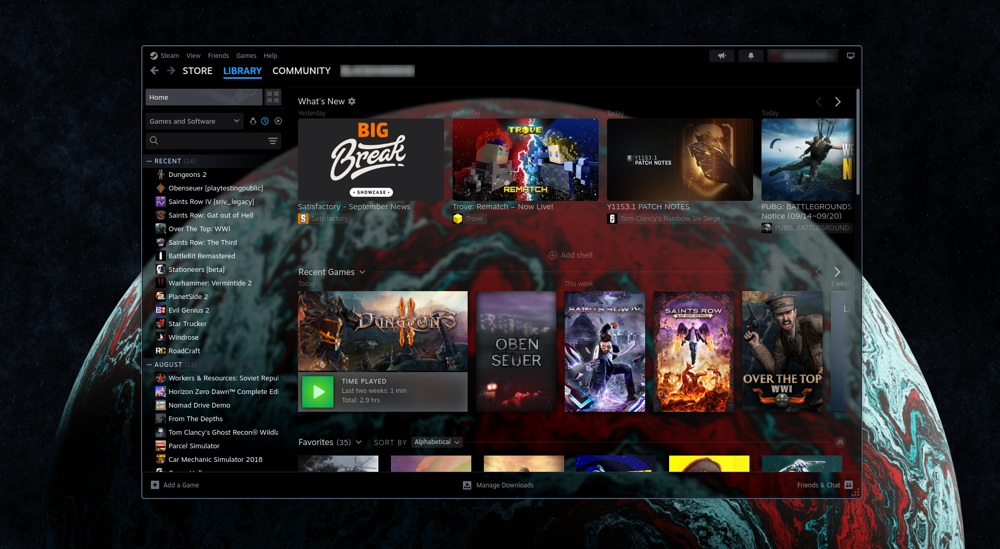

# Transparent Steam

A transparent theme for steam/[millenium](https://steambrew.app). Mostly faithful to the steam design but with some tweaks.

## Important info

If everything appears black instead of transparent try using the [Change Window Params](https://steambrew.app/plugin/70961284c213) plugin.
And enable transparency there.

This theme was made with tiling WM's in mind so the close, minimize, and maximise buttons are hidden by default.
This theme has an option to enable them again, if you want that.

## Limitations

I am currently only aiming for the steam client pages, the store/community hub will remain intransparent for the time being.

## How to use
1. Download or clone this repository.
2. Open Steam, select Steam -> Millenium -> Themes, click Browse local files and select the directory where you downloaded/cloned this repo.
3. Once added click Use and if not prompted restart steam to enjoy the transparent fancyness!
